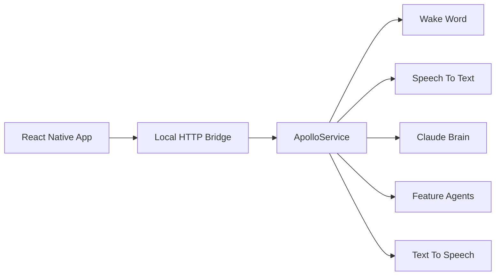

# 🚀 Production Deployment

## Deployment strategy

ApolloDroid is designed as a Python core with a mobile UI layer on top. The production path starts with an Android-first release, then adds a React Native UI through a local bridge so the same assistant logic can serve both Android and iOS.

### Recommended phases

1. **v1.0 Android stabilization**
   - Ship the existing Kivy + Briefcase app.
   - Finish the core assistant flow, settings, and feature handlers.
   - Validate wake word, STT, Claude, and TTS on real hardware.

2. **v1.5 React Native bridge**
   - Move the mobile UI to React Native for shared Android/iOS screens.
   - Keep the assistant logic in Python and expose it through a local API bridge.
   - Reuse the same command processing pipeline for both platforms.

3. **v1.5 Live Talking**
   - Add streaming transcription and lower-latency response handling.
   - Keep a short conversational context so the assistant can stay in flow.
   - Introduce graceful fallback behavior when streaming is unavailable.

4. **v2.0 iOS release**
   - Package the same assistant workflow for iOS.
   - Tighten audio, microphone, and background behavior for Apple’s platform rules.
   - Reuse the bridge and Python core rather than rewriting assistant logic.

## Bridge layer architecture

The bridge layer is the integration point between the React Native app and the Python assistant core.

### Responsibilities

- **React Native app**: handles screens, navigation, permissions, and user interaction.
- **HTTP bridge**: receives commands, status checks, and streaming events.
- **ApolloService**: orchestrates wake word, STT, intent resolution, feature dispatch, and TTS.
- **Feature agents**: execute domain-specific tasks such as timer, weather, and search.

### Initial API shape

- `POST /api/command` — submit a recognized command or audio payload.
- `GET /api/status` — check whether the assistant is ready.
- `GET /api/config` — expose non-sensitive runtime settings to the UI.
- `WebSocket /ws/stream` — support live talking and partial transcription later.

### Production rules

- Keep the bridge local-only for mobile devices.
- Avoid exposing API keys to the UI layer.
- Store secrets in the Python environment, not in the React Native bundle.
- Prefer explicit request/response contracts so the UI and core can evolve independently.
- Design for fallback: if streaming fails, the app should still support the basic wake word flow.

## Release checklist

- Verify `.env` values are present in the target environment.
- Run linting and tests before packaging.
- Confirm Android permissions for microphone, notifications, and foreground service use.
- Validate the deployment flow on a real device before publishing a release.